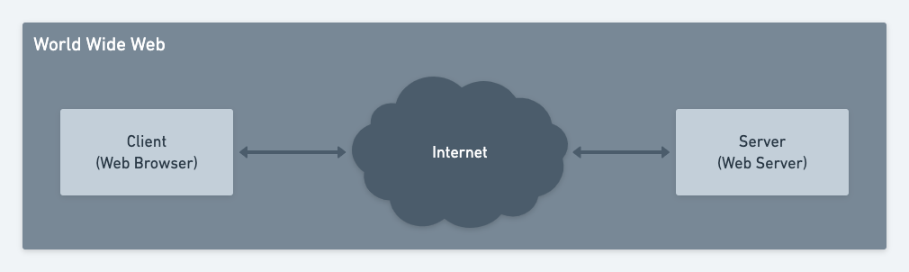

<!-- Remark.js style -->
<!--  class: middle, center -->

# World Wide Web

> A gentle introduction in 5 minutes

---

# History

> Brief history.

- Commonly known as **WWW**, **W3**, or simply **the Web**
- Invented in 1989 by the English scientist _Tim Berners-Lee_
- Global system of _interconnected_ computers
  - Exchange _web resources_ throught the **Internet**
  - Different from the **Internet**
- _World Wide Web Consortium (W3C)_
  - International organization
  - Standardize
  - Develop new feature

---

# Web Resource

> What can we find on the Web.

- Identify by an _Uniform Resource Locator (URL)_
  - Ex: [https://www.ulaval.ca/](https://www.ulaval.ca/)
- Types
  - _Web page_
  - Image
  - Video
  - ...
- Exchanged between **Client (web browser)** and **Server (web server)**
- _HyperText Transfer Protocol (HTTP)_

---

# Web page

> Anatomy of a Web page.

[Demo Web Page](./demo/index.html)

---

# Conclusion

- Basic mecanics of **the Web**
- Anatomy of a _Web page_
- **The Web** ≠ **Internet**
